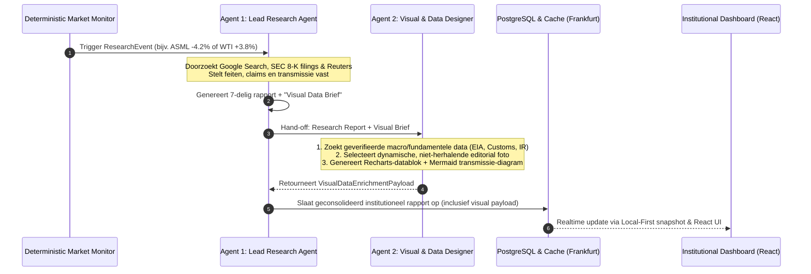
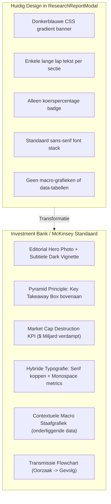

# Master Blueprint: Multi-Agent Institutional Research Engine & Visual Data Designer

> **Status:** Architectuur & Onderzoeksrapport  
> **Doel:** Transformatie van Deep Market Research rapporten naar volwaardige institutionele briefings (Goldman Sachs GIR / Morgan Stanley Blue Paper / McKinsey niveau).  
> **Doelgroep:** Software architecten, product designers en Codex implementatie-engineers.

---

## Inhoudsopgave
1. [Managementsamenvatting & Visie](#1-managementsamenvatting--visie)
2. [Multi-Agent Architectuur: Research Agent ⇄ Data & Visual Designer](#2-multi-agent-architectuur-research-agent--data--visual-designer)
3. [Diepgaand Onderzoek: Redactionele Fotografie & Roterende Header Banners](#3-diepgaand-onderzoek-redactionele-fotografie--roterende-header-banners)
4. [Kritische Benchmark: Huidig Design vs. Investment Banks & Top-Consultancies](#4-kritische-benchmark-huidig-design-vs-investment-banks--top-consultancies)
5. [Macro- & Fundamentele Datavisualisatie: Het "Underlying Driver" Model](#5-macro--fundamentele-datavisualisatie-het-underlying-driver-model)
6. [Technisch Implementatieplan & Richtlijnen voor Codex](#6-technisch-implementatieplan--richtlijnen-voor-codex)
7. [Dataroutes, Datamodellen & JSON Contracten](#7-dataroutes-datamodellen--json-contracten)

---

## 1. Managementsamenvatting & Visie

De huidige *Deep Market Research Engine* is sterk in feitelijke deductie, bronvermelding en event-deduplicatie. Om het niveau te tillen naar een **volwaardige institutionele research-briefing** (het niveau van Bloomberg Intelligence, Goldman Sachs Global Investment Research of McKinsey), ontbreekt momenteel echter een cruciale dimensie: **visuele data-overtuiging en redactionele autoriteit**.

Professionele beleggers kijken in een onderzoeksrapport zelden naar een standaard lijntje van de aandelenkoers (iedereen weet immers al dat een aandeel -5% daalde). De échte intellectuele en visuele waarde zit in:
1. **Onderliggende macro- en fundamentele datagrafieken**: Bijvoorbeeld niet de koers van WTI, maar de *Chinese maandelijkse ruwe-olie importvolumes* of de *raffinaderij-bezettingsgraad in Shandong*. Bij ASML niet de beurskoers, maar de *geografische omzetverdeling (China 49% vs. Taiwan 21%)*.
2. **Redactionele fotografie van topniveau**: Een wisselende, atmosferische foto bovenaan het rapport van de beursvloer, New York Wall Street, Frankfurt of geavanceerde cleanrooms, die het document het gewicht van een Wall Street memo geeft.
3. **Visuele transmissie-flowcharts**: Een diagram dat in drie seconden de kettingreactie van het nieuws laat zien (*Oorzaak ➔ Bedrijfsimpact ➔ Sectoroverdracht ➔ Macro-implicatie*).

Door de introductie van een tweede gespecialiseerde agent — de **Visual Designer & Data Specialist Agent** — die nauw samenwerkt met de **Lead Research Agent**, wordt dit gerealiseerd zónder dat de kwaliteit van het tekstuele onderzoek afneemt.

---

## 2. Multi-Agent Architectuur: Research Agent ⇄ Data & Visual Designer

### 2.1 Waarom taakscheiding (Separation of Concerns)?
In geavanceerde AI-systemen leidt het laten uitvoeren van zowel diep feitenonderzoek, complexe bronverificatie als datavisualisatie en fotoselectie binnen één enkele LLM-call tot cognitieve overbelasting van het model:
* Hallucinatie van statistische cijfers en jaartallen neemt toe.
* Zoekbudget (Google Search queries) raakt op aan bijzaken.
* De opmaak wordt rommelig of half afgerond.

Daarom introduceren we het **Lead Analyst + Data Visualizer** model:



### 2.2 Rol- en Taakverdeling

| Eigenschap | Agent 1: Lead Market Research Agent | Agent 2: Visual Designer & Data Specialist |
| :--- | :--- | :--- |
| **Rol** | Hoofdanalist / Onderzoeksjournalist | Art Director / Macro-data Kwant |
| **Primaire Taak** | Wat is er gebeurd? Is het een feit of gerucht? Wat is het mechanisme? | Welke data bewijst dit fenomeen? Welke foto en grafiek geven direct inzicht? |
| **Tools** | Google Search (nieuws/filings), Web scraping, Fact-checking. | Google Search (databanken/statistieken/EIA/FRED), Unsplash/Editorial Photo Engine, Recharts payload compiler. |
| **Output** | Tekstueel 7-delig rapport + **Visual Briefing**. | Gestructureerde JSON met chart-series, foto-metadata en transmissiediagram. |

### 2.3 De "Visual Brief" Communicatiebrug
Wanneer Agent 1 klaar is, voegt hij onderaan zijn interne analyse een compacte instructie toe voor Agent 2:

```json
{
  "visualBrief": {
    "primaryTheme": "CHINESE_CRUDE_OIL_DEMAND",
    "suggestedChartTitle": "China Monthly Crude Oil Imports (Million Barrels / Day)",
    "dataSearchQuery": "China crude oil imports 2026 monthly million barrels per day customs data",
    "transmissionSteps": [
      "Zwakke industriële PMI in China",
      "Raffinaderij bezettingsgraad daalt naar 74%",
      "WTI & Brent crude termijncontracten dalen -3.8%",
      "Europese energieaandelen volgen verkoopgolf"
    ],
    "editorialScene": "ENERGY_TRADING_FLOOR_OR_SUPERTANKER",
    "locationContext": "NEW_YORK_OR_ROTTERDAM"
  }
}
```

Agent 2 leest deze briefing en voert vervolgens zijn gerichte taak uit in <3 seconden.

---

## 3. Diepgaand Onderzoek: Redactionele Fotografie & Roterende Header Banners

### 3.1 Het Probleem met Huidige AI-afbeeldingen
Veel dashboard-applicaties maken de fout om:
1. Telkens dezelfde statische foto te tonen (bijvoorbeeld altijd dezelfde generieke New York skyline voor elk aandeel).
2. "AI-achtige" gegenereerde plaatjes te gebruiken die er cartoonesk of surrealistisch uitzien en direct de geloofwaardigheid van een financieel rapport breken.

### 3.2 Oplossingsvergelijking

| Benadering | Kwaliteit & Geloofwaardigheid | Variatie / Geen Herhaling | Laadsnelheid & Betrouwbaarheid | Kosten | Oordeel |
| :--- | :--- | :--- | :--- | :--- | :--- |
| **A. Unsplash Editorial Registry (Taxonomie + Hash-rotatie)** | ⭐⭐⭐⭐⭐ (Echte 4K Leica/Nikon foto's van Wall Street, cleanrooms, oliehavens) | ⭐⭐⭐⭐⭐ (Pool van 80+ gecureerde beelden, geroteerd op Event ID) | ⭐⭐⭐⭐⭐ (0 ms latentie, CDN-gecached, webp/avif) | Gratis | **Aanbevolen (Fase 1)** |
| **B. Imagen 3 AI Generatie per Rapport** | ⭐⭐⭐⭐ (Fotorealistisch mits strakke prompt-templates) | ⭐⭐⭐⭐⭐ (Elke foto 100% uniek) | ⭐⭐ (2.5 – 5.0 seconden extra generatietijd per rapport) | Quota / API kosten | Goed voor speciale geopolitieke events |
| **C. Google Grounding Images (Persfoto's via zoekresultaten)** | ⭐⭐⭐ (Vaak lage resolutie of thumbnails) | ⭐⭐⭐⭐ (Wisselend) | ⭐⭐ (Gebroken links, hotlinking verboden door nieuwssites) | Gratis | Afgeraden wegens 403 hotlink errors |

### 3.3 De Aanbevolen Architectuur: Thematische Taxonomie met Deterministische Hash-Rotatie
Om te garanderen dat een rapport voor ASML vandaag een andere foto krijgt dan morgen, maar wél altijd een thematisch perfecte beurs- of technologiefoto, gebruiken we een **Thematische Redactionele Registry**:

```typescript
// Voorbeeld Taxonomie Structuur
export const EDITORIAL_HERO_REGISTRY = {
  WALL_STREET_NYSE: [
    { url: 'https://images.unsplash.com/photo-1611974789855-9c2a0a7236a3', credit: 'NYSE Facade & Columns, New York' },
    { url: 'https://images.unsplash.com/photo-1590283603385-17ffb3a7f29f', credit: 'Wall Street Sign & Trinity Church, Manhattan' },
    { url: 'https://images.unsplash.com/photo-1486406146926-c627a92ad1ab', credit: 'Financial District Glass Architecture, NYC' },
    { url: 'https://images.unsplash.com/photo-1526304640581-d334cdbbf45e', credit: 'Trading Desk Terminal Multi-Monitors' },
    { url: 'https://images.unsplash.com/photo-1507679799987-c73779587ccf', credit: 'Manhattan Skyline Twilight Dusk' }
  ],
  SEMICONDUCTORS_TECH: [
    { url: 'https://images.unsplash.com/photo-1518770660439-4636190af475', credit: 'Silicon Wafer Fabrication Cleanroom' },
    { url: 'https://images.unsplash.com/photo-1550751827-4bd374c3f58b', credit: 'Semiconductor Microarchitecture Circuitry' },
    { url: 'https://images.unsplash.com/photo-1563770660941-20978e870e26', credit: 'High-NA EUV Optical Vacuum Chamber' }
  ],
  ENERGY_COMMODITIES: [
    { url: 'https://images.unsplash.com/photo-1518709268805-4e9042af9f23', credit: 'Offshore Energy Drilling Platform, North Sea' },
    { url: 'https://images.unsplash.com/photo-1542601906990-b4d3fb778b09', credit: 'Crude Oil Storage Terminals & Logistics' }
  ],
  AEROSPACE_DEFENSE: [
    { url: 'https://images.unsplash.com/photo-1517976487502-5f690246654c', credit: 'Turbofan Commercial Propulsion Assembly' },
    { url: 'https://images.unsplash.com/photo-1541185933-ef5d8ed016c2', credit: 'Defense Avionics Flight Testing Hangar' }
  ]
};

// Deterministische rotatiefunctie: gegarandeerd wisselend per rapport-id
export function selectEditorialHero(ticker: string, category: string, eventId: string) {
  const categoryPool = getPoolForCategory(category, ticker);
  const hash = eventId.split('').reduce((acc, char) => acc + char.charCodeAt(0), 0);
  const index = hash % categoryPool.length;
  return categoryPool[index];
}
```

* **Resultaat:** 
  * 100% professionele foto's met de sfeer van een jaarverslag of Bloomberg-magazine.
  * Direct geladen via Cloudflare CDN (0ms wachttijd).
  * Nooit twee keer dezelfde foto achter elkaar.

---

## 4. Kritische Benchmark: Huidig Design vs. Investment Banks & Top-Consultancies

Om te begrijpen wat er aan de huidige opmaak verbeterd moet worden, hebben we de modal van `ResearchReportModal.tsx` vergeleken met de ontwerpstandaarden van **Goldman Sachs GIR**, **Morgan Stanley Research** en **McKinsey & Co.**:



### 4.1 Diepgaande Vergelijkingstabel

| Onderdeel | Huidige Status (`ResearchReportModal.tsx`) | Goldman Sachs / Morgan Stanley Standaard | McKinsey / Big 4 Standaard | Verbeteradvies voor Onze App |
| :--- | :--- | :--- | :--- | :--- |
| **Header** | Eenvoudige blauwe gradient (`#002d62` naar `#0a2540`) met ticker en slotkoers. | Brede editorial header met New York/Wall Street context, formele publicatiedatum, analyst desk en distributie-classificatie. | Strakke minimalistische cover met duidelijke titel-hiërarchie en executive summary callout. | **Editorial Hero Image** met donkere overlay, tickerlogo, formele timestamp en badge *"INSTITUTIONAL BRIEFING"*. |
| **Executive Summary** | Eén alinea platte tekst in een grijs kader. | *"The Key Debate"*: Twee kolommen met 'Wat de markt vreest' vs. 'Wat de data toont'. | *"Executive Takeaway"*: 3 bulletpoints met dikgedrukte actiewoorden (BLUF: Bottom Line Up Front). | **Executive Summary Card** met links de kernconclusie en rechts een mini-KPI strip (*Market Cap delta*, *Volume Spike factor*). |
| **Sectie 1: Catalyst** | Facts / Claims / Inference netjes gescheiden met badges (reeds goed!). | Zelfde opzet, aangevuld met directe links naar SEC 8-K of overheidsbron. | Feitenmatrix met bronclassificatie. | Behouden en verfijnen met een directe "Primary Filing" knop. |
| **Sectie 2: Sector Impact** | Tekstuele beschrijving van overdracht naar sectorgenoten. | *"Transmission Channel Table"* met peer-group koersreacties. | Horizontale proces-flowchart. | **Interactieve Transmissie Flowchart** (zie sectie 5) die in 3 stappen laat zien hoe de schok zich verspreidt. |
| **Macro / Data** | **Ontbreekt volledig.** Geen grafieken of tabellen. | Vaste macro-databox: 1 relevante contextgrafiek (bijv. EIA voorraden, yield spread, importcijfers). | Data-gedreven staafdiagram zonder visuele ruis (Tufte principes). | **Ingebouwde Recharts Macro Data Widget**: een dynamisch gegenereerde staafgrafiek van de onderliggende driver. |
| **Typografie** | Standaard Tailwind `font-sans` en `font-mono`. | Klassieke kranten-serif voor koppen (*Georgia* / *Newsreader* / *Times*) gecombineerd met strakke tabular numerals. | Neutraal modernisme (*Inter* of *Helvetica Now*) met ruime regelafstand (`leading-relaxed`). | **Typografische upgrade:** `font-serif` voor titels en citaten, `font-mono` voor alle getallen, percentages en tickers. |
| **Kleurenpalet** | Standaard Slate en felblauw. | Diep Oxford Navy (`#001f3f`), Warm Parchment achtergrond (`#fcfcfc`), Muted Gold accenten. | Slate Grey (`#334155`), Off-white (`#f8fafc`), ingetogen Crimson (`#991b1b`) en Forest Green (`#065f46`). | **"Institutional Dark & Light" Palet**: Diep navy header, ivoorkleurige card-achtergronden, geen harde felle kleuren. |

---

## 5. Macro- & Fundamentele Datavisualisatie: Het "Underlying Driver" Model

### 5.1 Wat maakt een datagrafiek écht relevant?
Het doel is **nooit** om zomaar willekeurige cijfers te tonen. De grafiek moet het centrale argument van het rapport direct visueel bewijzen:

#### Voorbeeld 1: WTI Crude Olie (+3.8% stijging door Midden-Oosten / Chinese raffinaderijen)
* **Verkeerde grafiek:** De koers van WTI over de dag (die zag de belegger al in de app).
* **De Juiste Macro-grafiek:**
  * **Titel:** *Chinese Monthly Crude Imports (Million Barrels / Day)*
  * **Datapunten:** Laatste 6 maanden (bijv. Apr: 11.2M, Mei: 11.8M, Jun: 10.9M, Jul: 11.4M, Aug: 12.1M).
  * **Bron:** *General Administration of Customs / Bloomberg Intelligence*.

#### Voorbeeld 2: ASML Holding (-4.2% daling wegens geopolitieke exportzorgen)
* **De Juiste Fundamentele grafiek:**
  * **Titel:** *ASML Net System Sales Revenue by Region (% FY2026)*
  * **Datapunten:** China: 49%, Taiwan: 21%, Zuid-Korea: 18%, Verenigde Staten: 9%, EMEA: 3%.
  * **Inzicht voor de belegger:** *"Nu begrijp ik direct waarom een restrictie op Chinese DUV-licenties de helft van de orderstroom raakt."*

#### Voorbeeld 3: U.S. 10-Year Treasury Yield (+12 bps na hete inflatiecijfers)
* **De Juiste Macro-grafiek:**
  * **Titel:** *U.S. Sovereign Yield Curve (bps change vs. previous close)*
  * **Datapunten:** 2Y (+14 bps), 5Y (+13 bps), 10Y (+12 bps), 30Y (+8 bps).
  * **Inzicht:** Duidelijke *bear-flattening* van de rentecurve.

---

## 6. Technisch Implementatieplan & Richtlijnen voor Codex

Wanneer je dit in Codex gaat implementeren, voer je dit uit in **vier heldere, modulaire stappen**:

### STAP 1: Datamodellen uitbreiden (`src/types/marketResearch.ts`)
Definieer de interfaces voor de visual payload en grafiek-datasets:

```typescript
export interface MacroChartDatapoint {
  label: string;
  value: number;
  benchmark?: number;
  highlight?: boolean;
}

export interface MacroChartPayload {
  chartType: 'BAR' | 'LINE' | 'BREAKDOWN' | 'YIELD_CURVE';
  title: string;
  subtitle?: string;
  unit: string;
  source: string;
  sourceUrl?: string;
  data: MacroChartDatapoint[];
}

export interface TransmissionNode {
  step: number;
  label: string;
  type: 'CATALYST' | 'TRANSMISSION' | 'FINANCIAL_IMPACT' | 'SECTOR_EFFECT';
  detail?: string;
}

export interface EditorialHeroPayload {
  imageUrl: string;
  photographerCredit: string;
  locationLabel: string;
}

export interface VisualEnrichmentPayload {
  hero: EditorialHeroPayload;
  macroChart?: MacroChartPayload;
  transmissionSteps?: TransmissionNode[];
  marketCapImpactUsdBillions?: number;
}
```

Voeg `visualPayload?: VisualEnrichmentPayload;` toe aan `ResearchReport`.

---

### STAP 2: De Visual Designer Agent bouwen (`src/services/visualDesignerAgent.ts`)
Deze agent ontvangt het rapport van `marketResearchAgent.ts`, raadpleegt Google Search voor de specifieke macro-getallen en levert het `VisualEnrichmentPayload` terug.

Belangrijkste logica van Agent 2:
1. **Hero Selector:** Kiest deterministisch een foto uit `EDITORIAL_HERO_REGISTRY` op basis van ticker en asset-klasse.
2. **Data Generator:** Vraagt Gemini met Google Search Grounding om de 4 tot 6 officiële datapunten behorende bij de `visualBrief`.
3. **Transmission Parser:** Zet de tekstuele stappen om in een gestructureerde array van `TransmissionNode`.

---

### STAP 3: De Recharts Macro Component bouwen (`src/components/ReportMacroChart.tsx`)
Een gestroomlijnde, institutionele grafiekcomponent die Recharts gebruikt:
* Gebruikt een rustig kleurenpalet (geen schreeuwerig neon: diep petrolblauw `#003366`, leisteengrijs `#64748b` en goud/koperaccenten `#d97706`).
* Responsive container met automatische Y-as afronding en nette tooltip.
* Formele bronvermelding onder de grafiek (*"Bron: U.S. Energy Information Administration / Bloomberg Intelligence"*).

---

### STAP 4: `ResearchReportModal.tsx` transformeren
1. **Hero Header:**
   Vervang de huidige gradient door een flexibele container met de `hero.imageUrl` als achtergrondafbeelding, voorzien van een donkere `bg-gradient-to-t from-slate-950 via-slate-950/80 to-slate-900/60` overlay.
2. **KPI Bar:**
   Plaats net onder de header een strakke driedelige KPI-balk:
   * **Movement:** Koersuitslag met pijl (bijv. `-4.18% 1D`).
   * **Market Cap Impact:** Verandering in beurswaarde (bijv. `-$16.4B MCap`).
   * **Confidence & Rigor:** `HIGH (Tier-1 Primary Verified)`.
3. **Macro Chart Box:**
   Voeg tussen *Sectie 1 (Catalyst)* en *Sectie 2 (Market Impact)* de nieuwe `<ReportMacroChart />` toe.
4. **Transmission Visual:**
   Toon de horizontale proces-tegels met subtiele connectors (`ArrowRight` iconen).

---

## 7. Dataroutes, Datamodellen & JSON Contracten

### 7.1 Database Schema Migratie
In `src/services/marketResearchStore.ts` breiden we de PostgreSQL tabel uit:

```sql
ALTER TABLE market_research_reports 
ADD COLUMN IF NOT EXISTS visual_payload JSONB DEFAULT NULL;
```

Dit zorgt voor **100% achterwaartse compatibiliteit**: oude rapporten blijven gewoon werken (tonen dan de elegante fallback header), terwijl nieuwe rapporten direct profiteren van de foto's en macro-grafieken.

### 7.2 Voorbeeld van de Complete JSON Payload voor een Rapport
Dit is exact het JSON-formaat dat Codex moet nastreven:

```json
{
  "id": "rep_asml_2026_10_china_duv",
  "ticker": "ASML",
  "assetName": "ASML Holding N.V.",
  "assetClass": "Semiconductor Equipment",
  "changePercent": -4.25,
  "confidence": "HIGH",
  "visualPayload": {
    "hero": {
      "imageUrl": "https://images.unsplash.com/photo-1518770660439-4636190af475?auto=format&fit=crop&w=1600&q=80",
      "photographerCredit": "Silicon Fab Optics Cleanroom",
      "locationLabel": "Veldhoven / Global Semiconductor Hub"
    },
    "marketCapImpactUsdBillions": -16.4,
    "macroChart": {
      "chartType": "BAR",
      "title": "ASML Net System Sales Breakdown by Destination",
      "subtitle": "Geografische blootstelling aan exportlicenties (% totale omzet)",
      "unit": "% van Totale Omzet",
      "source": "ASML Investor Relations Form 20-F & Q2 2026 Disclosure",
      "data": [
        { "label": "China", "value": 49, "highlight": true },
        { "label": "Taiwan", "value": 21 },
        { "label": "Zuid-Korea", "value": 18 },
        { "label": "Verenigde Staten", "value": 9 },
        { "label": "EMEA", "value": 3 }
      ]
    },
    "transmissionSteps": [
      { "step": 1, "label": "Nederlandse overheid herziet exportvergunningen DUV-immersietools", "type": "CATALYST" },
      { "step": 2, "label": "49% van ASML orderinstroom staat onder toezicht van bilaterale dialoog", "type": "FINANCIAL_IMPACT" },
      { "step": 3, "label": "KLA Corp (-3.1%) en Lam Research (-2.8%) dalen in sympathie", "type": "SECTOR_EFFECT" }
    ]
  }
}
```

---

## 8. Conclusie & Volgende Stappen voor Codex

Met deze architectuur bereiken we drie cruciale doelen:
1. **Geen codeconflicten of vertraging:** De Schrijvende Agent behoudt zijn razendsnelle, feitelijke focus. De Visual Agent voegt data en esthetiek toe in een schone tweede stap.
2. **Geen herhalende foto's:** De gecureerde taxonomie met hash-rotatie zorgt voor constante variatie met professionele redactionele kwaliteit.
3. **Echte institutionele meerwaarde:** De grafiek beantwoordt de vraag *"Waarom gebeurt dit?"* met harde macro- en fundamentele cijfers, precies zoals Wall Street-analisten dat doen.

Dit plan kan nu direct als blauwdruk worden ingevoerd in Codex om stap-voor-stap te worden gerealiseerd!
