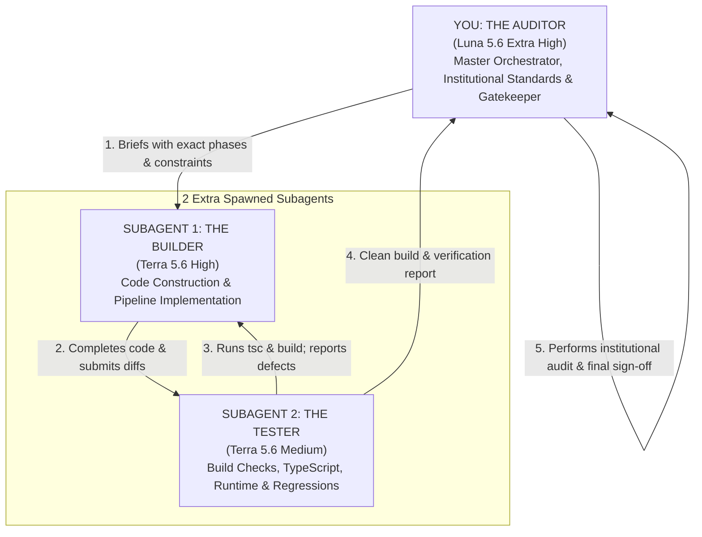

# 07_AGENTS: MULTI-AGENT BUILDER - TESTER - AUDITOR EXECUTION FRAMEWORK

> **PURPOSE OF THIS DOCUMENT:**  
> This specification defines the operational governance and multi-agent execution framework for implementing the Institutional Research Designer engine (`agents/06_INSTITUTIONAL_RESEARCH_DESIGNER_ARCHITECTURE.md`).
>
> **CORE ARCHITECTURE (2 EXTRA SUBAGENTS + YOU AS AUDITOR):**  
> * **YOU (The Lead Orchestrator / Codex / Main AI)** are **THE AUDITOR**  
>   * Model: **Luna 5.6 (Extra High Reasoning Effort)** *(Fallback: Luna 5.6 High)*  
> * You spawn and delegate to **2 EXTRA SUBAGENTS IN TOTAL**:  
>   1. **SUBAGENT 1: THE BUILDER** (Full-Stack Implementation & Construction)  
>      * Model: **Terra 5.6 (High Reasoning Effort)** *(Fallback: Luna 5.6 High)*  
>   2. **SUBAGENT 2: THE TESTER** (Compilation, Typechecking & Runtime QA)  
>      * Model: **Terra 5.6 (Medium Reasoning Effort)** *(Fallback: Luna 5.6 High)*  

---

## 1. Multi-Agent Team Structure & Workflow

---

## 2. Detailed Agent Roles & Mandates

### ROLE 1: YOU — THE AUDITOR (Lead Orchestrator & Final Authority)
* **Identity:** You are the receiving agent of the Master Prompt in `06_INSTITUTIONAL_RESEARCH_DESIGNER_ARCHITECTURE.md`.
* **Model Configuration:** `Luna 5.6` with **Extra High Reasoning Effort** *(Fallback: `Luna 5.6 High`)*.
* **Core Mandate:**
  You do not write all low-level boilerplate yourself. Instead, you act as the Senior Architect, Institutional Auditor, and Gatekeeper. You command the 2 extra subagents (Builder and Tester), audit their work against Tier-1 Wall Street benchmarks (Goldman Sachs GIR, Morgan Stanley Blue Papers, McKinsey), and provide final sign-off.
* **Auditor Responsibilities & Checklist:**
  1. **Briefing:** Hand off Phases 1–5 to Subagent 1 (The Builder) with strict instructions.
  2. **Editorial Photo Authenticity Audit:**
     - [ ] Verify that 100% of images in `EDITORIAL_HERO_REGISTRY` are authentic, real editorial photographs (NYSE, Nasdaq, cleanrooms, refineries, trading desks).
     - [ ] Strictly reject any AI-generated cartoon graphics, surreal renders, or fragile 403-prone external hotlinks.
     - [ ] Verify deterministic hash rotation: successive events for the same ticker MUST display different photographs.
  3. **Financial Data Integrity Audit:**
     - [ ] Verify that financial figures, macro statistics, and filings are NEVER fabricated by the model.
     - [ ] Confirm Google Search grounding is enabled in `visualDesignerAgent.ts` with sensible fallback values.
  4. **Institutional UX/UI Audit:**
     - [ ] Inspect `ResearchReportModal.tsx`: dark vignette on hero photo, hybrid typography (serif headings + tabular monospace figures), 3-part KPI strip (Movement %, Market Cap impact in $B, Rigor rating), and Tufte-style Recharts macro box.
  5. **Non-Regression Audit:**
     - [ ] Verify that the existing `Global News Agent` and existing `marketResearchAgent` routes remain 100% intact and undamaged.
     - [ ] Ensure database migration `visual_payload JSONB` is idempotent (`IF NOT EXISTS`).
  6. **Final Sign-off:** Issue a formal `PASS / FAIL` audit scorecard before committing.

---

### ROLE 2: SUBAGENT 1 — THE BUILDER (Construction & Implementation)
* **Model Configuration:** `Terra 5.6` with **High Reasoning Effort** *(Fallback: `Luna 5.6 High`)*.
* **Spawning:** Spawned as an extra subagent by the Auditor.
* **Core Mandate:**
  Writes, edits, and creates all application code. Delivers complete, working, production-grade files without incomplete stubs or `// TODO` placeholders.
* **Execution Scope (Phases 1–5):**
  1. **Phase 1 (`src/types/marketResearch.ts`):**
     - Add `VisualBrief`, `MacroChartPayload`, `EditorialHeroPayload`, `TransmissionNode`, and `VisualEnrichmentPayload`.
     - Update `ResearchReport` to include `visualPayload?: VisualEnrichmentPayload`.
  2. **Phase 2 (`src/services/visualDesignerAgent.ts` — CREATED FROM SCRATCH):**
     - Setup Antigravity Agent using Gemini 3.8 Flash (medium reasoning) + Google Search tool grounding.
     - Implement `EDITORIAL_HERO_REGISTRY` containing 100% real high-res photography.
     - Implement deterministic hash rotation (`selectEditorialHero`).
     - Implement `calculateMarketCapImpact` in billions of USD.
     - Implement live macro data retrieval with Gemini Google Search and fallback.
  3. **Phase 3 (`src/services/marketResearchAgent.ts`):**
     - Build the tandem pipeline: implement `deriveVisualBrief`.
     - Call `runVisualDesignerAgent` directly upon report completion and store enriched payload.
  4. **Phase 4 (`src/components/ReportMacroChart.tsx` — CREATED FROM SCRATCH):**
     - Build Recharts institutional visualization component (Oxford Navy, Slate, amber highlights, source attribution).
  5. **Phase 5 (`src/components/ResearchReportModal.tsx`):**
     - Implement real photo hero header with dark gradient vignette.
     - Implement 3-part KPI strip (Movement, MCap delta, Rigor).
     - Embed `<ReportMacroChart />` and causal transmission flow tiles.
  6. **Phase 6 (`src/services/marketResearchStore.ts`):**
     - Add idempotent migration: `ALTER TABLE market_research_reports ADD COLUMN IF NOT EXISTS visual_payload JSONB DEFAULT NULL;`.

---

### ROLE 3: SUBAGENT 2 — THE TESTER (Compilation, Runtime QA & Regressions)
* **Model Configuration:** `Terra 5.6` with **Medium Reasoning Effort** *(Fallback: `Luna 5.6 High`)*.
* **Spawning:** Spawned as an extra subagent by the Auditor.
* **Core Mandate:**
  Validates code correctness, compiles the application, tests backward compatibility, detects regressions, and reports issues back to the Builder.
* **Verification Scope:**
  1. **TypeScript Typecheck:**
     - Execute `npx tsc --noEmit`. Must exit with **exact 0 errors**.
     - Catch any type mismatches, missing props, or interface discrepancies.
  2. **Production Build:**
     - Execute `npm run build` (`vite build`). Verify clean bundle generation without syntax or rollup errors.
  3. **Backward Compatibility & Crash Prevention:**
     - Verify that existing reports in the database without `visual_payload` render seamlessly with zero undefined crashes or console errors.
     - Verify that existing `Global News Agent` views and API routes are 100% operational.
  4. **Hash Rotation Verification:**
     - Verify that two different event IDs (`evt_101` vs `evt_102`) for ticker `ASML` resolve to different real photo URLs from the pool.
  5. **Defect Reporting:**
     - If any test fails, produce exact file and line error descriptions and instruct Subagent 1 (The Builder) to resolve them.

---

## 3. Orchestration Protocol

| Step | Actor | Action | Output / Deliverable |
| :--- | :--- | :--- | :--- |
| **1. Hand-off** | **Auditor (You)** | Spawns Subagent 1 (Builder) with phases from `06_INSTITUTIONAL_RESEARCH_DESIGNER_ARCHITECTURE.md`. | Execution instruction |
| **2. Construction** | **Builder** | Implements all files in `src/types/`, `src/services/`, and `src/components/`. | Code diffs & new files |
| **3. Verification** | **Tester** | Spawns Subagent 2 (Tester) to run `tsc`, `npm run build`, and backward compatibility checks. | Test report (0 errors) |
| **4. Fixes (if needed)**| **Builder ⇄ Tester** | Tester reports compilation issues; Builder fixes them until clean. | Green build |
| **5. Audit Review** | **Auditor (You)** | Reviews diffs, audits photo authenticity, financial data grounding, and Goldman/McKinsey design. | Audit Scorecard |
| **6. Sign-off** | **Auditor (You)** | Final approval and git commit. | Institutional Briefing Engine Live |

---

## 4. Model Fallback Matrix

If `Terra 5.6` is unavailable in the environment:
* **The Auditor (You):** `Luna 5.6 Extra High` (or `Luna 5.6 High`)
* **Subagent 1 (Builder):** `Luna 5.6 High`
* **Subagent 2 (Tester):** `Luna 5.6 High`
